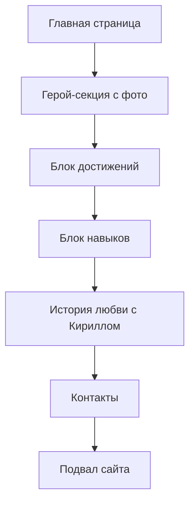

## 1. Product Overview
Юмористический лендинг о лучшем директологе Ольге Николаевне, которая продвигает бетонные заводы. Сайт создан в шуточной форме для демонстрации её профессиональных достижений и личных качеств, включая отношения с Кириллом Георгиевичем.

Цель: Показать Ольгу как суперспециалиста по директу и Авито с 2 красными дипломами, идеальную жену для Кирилла.

## 2. Core Features

### 2.1 User Roles
| Role | Registration Method | Core Permissions |
|------|---------------------|------------------|
| Гость | Без регистрации | Просмотр всего контента |

### 2.2 Feature Module
Лендинг состоит из следующих основных блоков:
1. **Главный экран**: герой-секция с фото Ольги и основными достижениями
2. **Блок достижений**: 2 красных диплома и кейсы по бетонным заводам
3. **Блок "Почему Оля крутая"**: навыки директолога и работы с Авито
4. **Блок отношений**: история любви с Кириллом Георгиевичем
5. **Контакты**: способы связи с супердиректологом

### 2.3 Page Details
| Page Name | Module Name | Feature description |
|-----------|-------------|---------------------|
| Главная страница | Герой-секция | Отображение фото Ольги, заголовок "Лучший директолог России", подзаголовок с упоминанием 2 красных дипломов |
| Главная страница | Достижения | Карточки с красными дипломами, количеством проданных бетонных заводов, успешными кейсами |
| Главная страница | Навыки | Перечень навыков: Direct, Авито, продажа бетонных заводов, таргетированная реклама |
| Главная страница | История любви | Рассказ о Кирилле Георгиевиче и почему Оля станет идеальной женой |
| Главная страница | Контакты | Телефон, Telegram, WhatsApp для связи с Ольгой |
| Главная страница | Подвал | Юмористическая подпись от Кирилла о том, какая Оля молодец |

## 3. Core Process
Пользователь заходит на сайт → видит герой-секцию с фото и достижениями → скроллит вниз, читает о навыках → видит блок с историей любви → доходит до контактов → уходит с впечатлением о супердиректологе.

## 4. User Interface Design

### 4.1 Design Style
- Основные цвета: красный (дипломы), белый (фон), розовый (акценты для романтики)
- Стиль кнопок: скругленные, с тенью, яркие
- Шрифт: современный sans-serif, крупные заголовки
- Компановка: карточечная система, мобильный-first
- Эмодзи: ❤️💪🎯🏆 для усиления юмористического эффекта

### 4.2 Page Design Overview
| Page Name | Module Name | UI Elements |
|-----------|-------------|-------------|
| Главная страница | Герой-секция | Крупное фото Ольги по центру, красный заголовок шрифтом 32px, анимированные цифры достижений |
| Главная страница | Достижения | Карточки с красными дипломами, счетчики проданных заводов, золотые звезды для визуального эффекта |
| Главная страница | Навыки | Иконки навыков в круглых рамках, прогресс-бары уровня мастерства, анимация при скролле |
| Главная страница | История любви | Фото Кирилла и Ольги вместе, сердечки анимация, текст в виде диалога |
| Главная страница | Контакты | Крупные кнопки связи, WhatsApp иконка зеленая, Telegram синяя, телефон красный |

### 4.3 Responsiveness
Мобильный-first дизайн, адаптивность под все экраны. На мобильных устройствах крупные элементы управления, увеличенные шрифты, удобное скроллирование одной рукой.