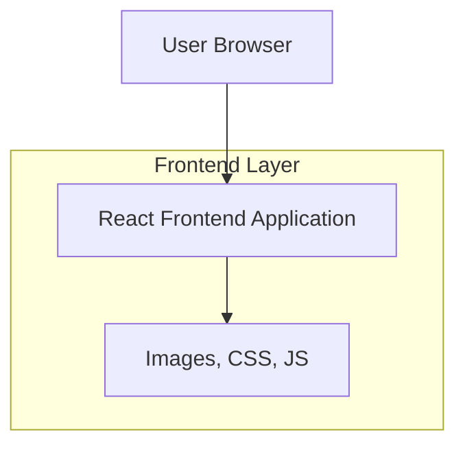

## 1. Architecture design



## 2. Technology Description

* Frontend: React\@18 + tailwindcss\@3 + vite

* Initialization Tool: vite-init

* Backend: None (статический лендинг)

* Хостинг: Vercel/Netlify (бесплатный хостинг для статических сайтов)

## 3. Route definitions

| Route | Purpose                                     |
| ----- | ------------------------------------------- |
| /     | Главная страница с полным контентом о Ольге |

## 4. Компонентная структура

### 4.1 Основные компоненты

```typescript
// Типы данных для компонентов
interface Achievement {
  id: string;
  title: string;
  description: string;
  icon: string;
  highlight?: boolean; // для красных дипломов
}

interface Skill {
  id: string;
  name: string;
  level: number; // 1-100
  icon: string;
}

interface Contact {
  id: string;
  type: 'phone' | 'telegram' | 'whatsapp';
  value: string;
  label: string;
}
```

### 4.2 Список компонентов

* `HeroSection` - герой-секция с фото и заголовком

* `AchievementCard` - карточка достижения (включая красные дипломы)

* `SkillsSection` - секция навыков директолога

* `LoveStory` - блок истории любви с Кириллом

* `ContactSection` - контактная информация

* `Footer` - подвал с юмористической подписью

## 5. Стили и анимации

### 5.1 CSS классы Tailwind

```css
/* Пример стилизации */
.hero-title {
  @apply text-4xl md:text-6xl font-bold text-red-600 text-center mb-4;
}

.achievement-card {
  @apply bg-white rounded-lg shadow-lg p-6 border-l-4 border-red-500;
}

.love-story {
  @apply bg-pink-50 rounded-xl p-8 text-center relative;
}
```

### 5.2 Анимации

* Анимированные счетчики достижений (прокрутка чисел)

* Появление элементов при скролле (Intersection Observer)

* Пульсация сердечек в блоке любви

* Параллакс эффект для фоновых элементов

## 6. Оптимизация производительности

### 6.1 Оптимизация изображений

* Использование формата WebP для фото

* Lazy loading для изображений

* Оптимизация размеров изображений под разные экраны

### 6.2 Код сплиттинг

* Разделение кода на чанки

* Динамический импорт тяжелых компонентов

* Минимизация и сжатие JavaScript/CSS

## 7. SEO и мета-теги

### 7.1 Мета-описание

```html
<meta name="description" content="Ольга Николаевна - лучший директолог России с 2 красными дипломами. Продвигает бетонные заводы на Авито и Direct. Идеальная жена для Кирилла Георгиевича.">
<meta name="keywords" content="директолог, авито, бетонные заводы, красные дипломы, Ольга Николаевна">
```

### 7.2 Open Graph теги

* Изображение Ольги для превью

* Заголовок и описание для социальных сетей

* Twitter Card разметка

## 8. Деплой и хостинг

### 8.1 Сборка проекта

```bash
npm run build
npm run preview
```

### 8.2 Деплой на Vercel

* Автоматический деплой из GitHub

* Настройка кэширования статических ресурсов

* Настройка CDN для быстрой загрузки по всему миру

### 8.3 Мониторинг

* Google Analytics для отслеживания посещений

* Console.log для отладки в продакшене (по необходимости)

